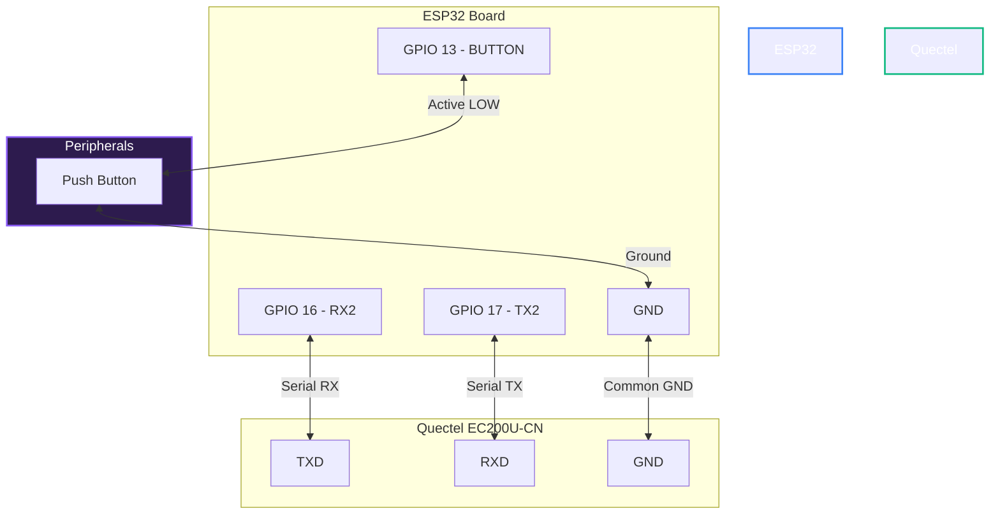
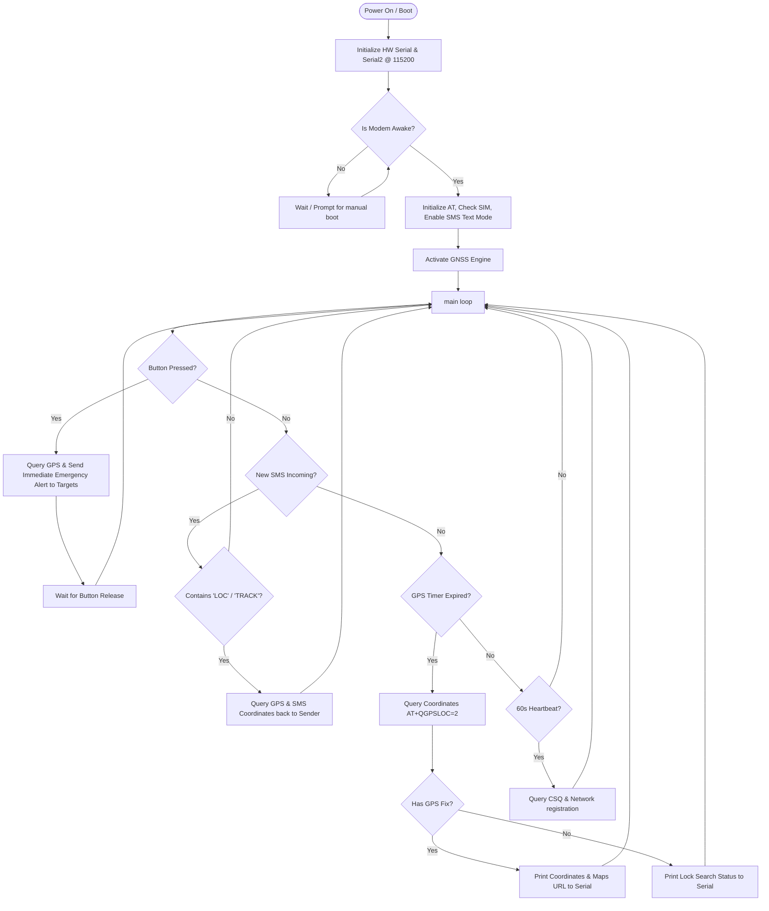

# SAFEDOT GPS & GSM Tracker (ESP32 & Quectel EC200U-CN)

An advanced, high-accuracy geolocation tracking and alert system built on the **ESP32** development board and interfaced with the powerful **Quectel EC200U-CN** LTE/GSM/GNSS modem. 

This standalone module queries coordinates from real GPS satellites, monitors cell signal strength, handles physical button panic triggers, and responds to incoming remote tracking commands—all while optimizing data transmissions via SMS to conserve battery and SIM card balance.

---

## 🚀 Key Features

* **Dual-Engine Geolocation:** Queries the Quectel GNSS engine using precise decimal coordinate parsing (`AT+QGPSLOC=2`).
* **Automated Alert Broadcasting:** Automatically sends real-time GPS coordinates, altitude, and a clickable Google Maps URL to designated emergency contacts.
* **Cellular Network Heartbeat:** Periodically monitors signal quality (`AT+CSQ`) and GSM registration status (`AT+CREG?`) every 60 seconds.
* **Emergency Panic Button:** Features a physical hardware button panic trigger (with debouncing and release locks) for instant location broadcasting.
* **On-Demand Remote SMS Tracking:** Listens to incoming SMS requests (e.g. `LOC`, `TRACK`, `LOCATION`) and replies with the current live location coordinates.
* **SIM Cost Protection:** Includes a smart 5-minute cooldown timer (`SMS_ALERT_INTERVAL`) on automated location SMS broadcasts to prevent balance drainage.
* **Intelligent Boot Logic:** Automatically tests if the modem is already powered on before pulsing the `PWRKEY` pin to avoid turning it off accidentally.

---

## 🛠️ Required Hardware

1. **ESP32 Development Board** (e.g., ESP32-WROOM-32 Dev Kit)
2. **Quectel EC200U-CN LTE/GNSS Modem Board** (with external cellular and GNSS antennas)
3. **Tactile Push Button** (Panic trigger)
4. **Jumper Wires & Breadboard**
5. **Stable 5V Power Supply** (via USB-C or external regulator to handle GSM transmit currents)

---

## 🔌 Wiring Schematic

The ESP32 communicates with the Quectel EC200U-CN using **Hardware Serial2** (`RX2` and `TX2`). It also uses control pins to handle hard resets and power states.

### 📌 Pin Mapping Table

| Device (ESP32) | Pin Type | Connection (Quectel EC200U-CN) | Description |
|:---|:---|:---|:---|
| **GPIO 16 (RX2)** | Input | **TXD** (Modem TX) | Data reception from modem |
| **GPIO 17 (TX2)** | Output | **RXD** (Modem RX) | Data transmission to modem |
| **GPIO 5** | Unused | *Not Connected (-1)* | Disabled in code |
| **GPIO 4** | Unused | *Not Connected (-1)* | Disabled in code |
| **GPIO 13** | Input | **Tactile Button Pin 1** | Physical panic button (Pull-up) |
| **GND** | Ground | **GND** | Common ground reference (Mandatory) |
| **GND** | Ground | **Tactile Button Pin 2** | Grounds the pin when pressed |

### 📊 Connection Flow Diagram



---

## ⚙️ Software Configuration

The configuration parameters are defined directly at the top of [gps_tracker.ino](file:///a:/SAFEDOT/GPS%20MODULE/gps_tracker.ino).

### 📞 Contact List Setup
Ensure that the target mobile numbers are in full international format (e.g. `+91` country code for India):
```cpp
const int NUM_TARGET_PHONES = 2;
const String TARGET_PHONES[NUM_TARGET_PHONES] = {
  "+916392449475",
  "+919610120255"
};
```

### ⏱️ Tuning Cooldowns & Query Intervals
You can tweak the performance parameters below depending on your application needs:
```cpp
const unsigned long GPS_QUERY_INTERVAL = 20000;  // Query satellite coordinates every 20s
const unsigned long HEARTBEAT_INTERVAL = 60000;  // Monitor signal and registration every 60s
```

---

## 🔄 System Architecture & Logical Flow

The system runs a fully cooperative non-blocking loop designed to respond instantly to physical inputs, network interruptions, and incoming queries.



---

## 💡 Key Code Mechanisms

### 1. Safe Intelligent Power-On Routine
Instead of blind PWRKEY pulsing, which can turn off an already active modem, SAFEDOT queries the modem first:
```cpp
void powerOnModem() {
  String response;
  Serial.println(F("🔍 Checking if EC200U is already awake..."));
  if (sendATCommand("AT", "OK", 1500, response)) {
    Serial.println(F("⚡ Modem is already powered ON."));
    return;
  }
  // Since PWR_KEY_PIN is disabled (-1), warn the user to power on manually
  Serial.println(F("⚠️ Modem is not responding. Please turn it on manually."));
}
```

### 2. High-Accuracy Location Query & Parsing
We use `AT+QGPSLOC=2` which directly outputs coordinates in a signed decimal format (rather than degrees-minutes-seconds), making Google Maps URL construction extremely clean:
```cpp
// Queries: UTC, Latitude, Longitude, HDOP, Altitude, Fix, COG, Speed, Date, Satellites
if (sendATCommand("AT+QGPSLOC=2", "+QGPSLOC:", 3000, response)) {
  // Parsed outputs directly generate Google Maps URL:
  String mapsLink = "https://maps.google.com/?q=" + latitude + "," + longitude;
}
```

---

## ⚠️ Important Notices & Operational Tips

> [!IMPORTANT]
> **Common Ground Connection:**
> Ensure a solid, common ground connection exists between the ESP32 and the Quectel EC200U board. Missing ground references will cause severe UART noise and cause command timeouts.

> [!WARNING]
> **Modem Power Source:**
> Cellular modules pull significant current spikes (up to 2A) during network handshakes and SMS transmission. Do not power the Quectel board directly from the ESP32's 3.3V pin. Use a dedicated 5V/2A supply or plug the Quectel board directly into USB-C.

> [!TIP]
> **First-Time GPS Fix (Cold Start):**
> When starting indoors, the GNSS antenna may struggle to lock onto satellites. Place the GPS antenna near a window or outdoors. The initial satellite lock can take up to 2-3 minutes.

---

## 🚀 Flashing & Running the System

1. Open your **Arduino IDE**.
2. Select your ESP32 board in `Tools` ➔ `Board` ➔ `ESP32 Arduino` (e.g., `ESP32 Dev Module`).
3. Connect the ESP32 to your PC, and select the correct port in `Tools` ➔ `Port`.
4. Open the Serial Monitor and configure the speed to `115200` baud.
5. Upload the sketch to your board. *(If the compiler fails, ensure the ESP32 core is installed in Arduino IDE's Boards Manager).*
6. View the logs on the Serial Monitor to monitor the boot sequence, network registration, and real-time GPS coordinate fixes!

---

## 🌐 100% Free Live Map Tracking Integration

SAFEDOT now features a **100% free, real-time live map tracking interface** with zero signups, zero API subscription keys, and zero databases to configure!

### How It Works:
1. **Background GPRS Upload:** The tracker automatically registers its cellular GPRS context on boot using your carrier's APN (configured as `#define GPRS_APN` in the code). Every 20 seconds, when a valid GPS lock is found, the ESP32 establishes a fast TCP socket connection and streams coordinates to **dweet.io** (a free, zero-config IoT gateway) under a secure, unique tracker ID (automatically generated from your ESP32's unique MAC address).
2. **Instant Emergency SMS:** When you press the physical button on **GPIO 13**, it sends an SMS with the standard static Google Maps link *and* a continuous map notice containing your device's unique Tracker ID.
3. **Smooth Interactive Live Map:** Double-click the premium [live_map.html](file:///a:/SAFEDOT/GPS%20MODULE/live_map.html) file in this directory to open it in any web browser on your phone, tablet, or PC.
   * If you open it with a parameter (e.g. `live_map.html?id=safedot-xxxxxxxxxxxx`), it connects instantly.
   * Otherwise, enter your unique Tracker ID into the premium dark-mode console.
   * The page will **automatically and smoothly refresh the person's location marker every 5 seconds in real-time** as they move, complete with stats (latitude, longitude, altitude) and a beautiful neon trail!

### 📶 On-Board WiFi Hotspot & Web Server (100% Offline Tracking)

In addition to cellular 4G GPRS streaming, SAFEDOT has an **on-board Web Server** that runs directly on the ESP32 chip! This is ideal for close-range (up to 30 meters) tracking, off-grid testing, or if your SIM card has no active GPRS plan.

1. **Connect to the Hotspot:** Power on your tracker, open your phone's WiFi settings, and connect to:
   * **WiFi SSID:** `SAFEDOT-TRACKER`
   * **Password:** `safedot123`
2. **Access the On-Board Map:** Open your browser and navigate to:
   * **URL:** `http://192.168.4.1`
3. **Local Position Syncing:** The ESP32 will serve the beautiful Leaflet interactive map directly from its flash memory (`PROGMEM`)! The webpage will automatically detect it is running locally and stream live coordinates straight from the ESP32's local API `/api/location` with **zero internet or SIM data required**!

> [!TIP]
> **SIM Internet Connection:**
> Make sure your GSM SIM card has basic 4G mobile internet (GPRS data) activated for long-range tracking. The GPRS streams consume less than **1 KB per upload**, meaning your mobile data costs will be virtually zero!
